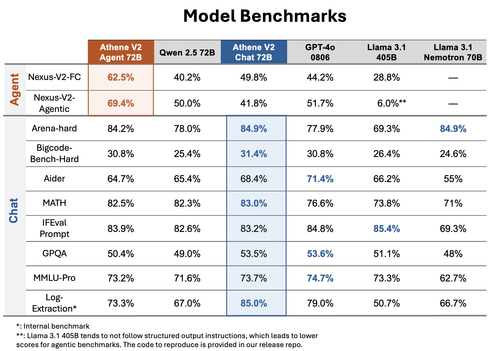

# Athene-V2-Chat-72B: Rivaling GPT-4o across Benchmarks

<p align="center">
<a href="https://huggingface.co/Nexusflow" target="_blank">Nexusflow HF</a> - <a href="https://discord.gg/HDSVmNAs3y" target="_blank">Nexusflow Discord</a> - <a href="https://nexusflow.ai/blogs/athene-v2" target="_blank">Athene-V2 Blogpost</a>
</p>


We introduce Athene-V2-Chat-72B, an open-weights LLM on-par with GPT-4o across benchmarks. It is trained through RLHF with Qwen-2.5-72B-Instruct as base model.
Athene-V2-Chat-72B excels in chat, math, and coding. Its sister model, [Athene-V2-Agent-72B](https://huggingface.co/Nexusflow/Athene-V2-Agent), surpasses GPT-4o in complex function calling and agentic applications.


<p align="center" width="100%">
<a></a>
</p>

- **Developed by:** The Nexusflow Team
- **Model type:** Chat Model
- **Finetuned from model:** [Qwen 2.5 72B-Instruct](https://huggingface.co/Qwen/Qwen2.5-72B-Instruct)
- **License**: [Nexusflow Research License](https://huggingface.co/Nexusflow/Athene-V2-Chat/blob/main/Nexusflow_Research_License_.pdf)
- **Blog**: https://nexusflow.ai/blogs/athene-v2

## Usage
Athene-V2-Chat uses the same chat template as Qwen2.5-72B-Instruct. Below is an example simple usage using the Transformers library.

```Python
from transformers import AutoModelForCausalLM, AutoTokenizer

model_name = "Nexusflow/Athene-V2-Chat"

model = AutoModelForCausalLM.from_pretrained(
    model_name,
    torch_dtype="auto",
    device_map="auto"
)
tokenizer = AutoTokenizer.from_pretrained(model_name)

prompt = "Write a Python function to return the nth Fibonacci number in log n runtime."

messages = [
    {"role": "user", "content": prompt}
]

text = tokenizer.apply_chat_template(
    messages,
    tokenize=False,
    add_generation_prompt=True
)

model_inputs = tokenizer([text], return_tensors="pt").to(model.device)

generated_ids = model.generate(
    **model_inputs,
    max_new_tokens=2048
)

generated_ids = [
    output_ids[len(input_ids):] for input_ids, output_ids in zip(model_inputs.input_ids, generated_ids)
]

response = tokenizer.batch_decode(generated_ids, skip_special_tokens=True)[0]
```

Note that by adding a system prompt that encourages the model to think step by step, the model can improve further on difficult math queries and problems like counting `r`s in strawberry. For fairness consideration we **do not** include such system prompt during chat evaluation.

## Acknowledgment
We would like to thank the [LMSYS Organization](https://lmsys.org/) for their support of testing the model. We would like to thank Qwen Team and the open source community for their efforts in providing the datasets and base models.